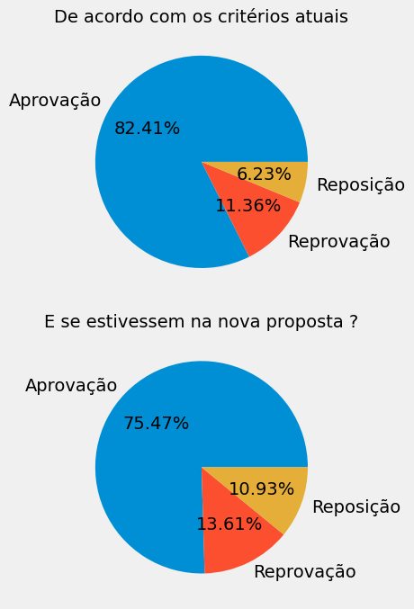
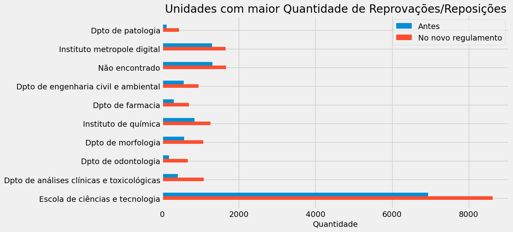

# Análise do Impacto da Nova Regulamentação
> Por: [Victor Vieira Targino](https://victorvieirat.github.io/)

---

1. [Análise do Impacto da Nova Regulamentação](#análise-do-impacto-da-nova-regulamentação)
2. [Notas](#notas)
3. [Reprovação](#reprovação)
4. [Impacto da Nova Política](#impacto-da-nova-política)
   1. [Na Reprovação Direta](#na-reprovação-direta)
   2. [Impacto da Nota Mínima na reprovação](#impacto-da-nota-mínima-na-reprovação)
5. [Impacto por Unidade Responsável](#impacto-por-unidade-responsável)

---

Visando contribuir para o debate da nova regulamentação da graduação da Universidade Federal do Rio Grande do Norte (UFRN), este relatório contém análises de dados do semestre 2022.2. A ideia dessa análise é comparar [Cartilha da gradução atual](https://arquivos.info.ufrn.br/arquivos/2014230053a0961803064f981f2aba6d3/Cartilha_do_novo_regulamento_de_graduao-pginaPROGRAD.pdf) com [as mudanças que estarão vigentes em 2024.1](https://www.ufrn.br/imprensa/noticias/72045/consepe-aprova-novo-regulamento-da-graduacao) e tentar verficar como na prática irá afetar os alunos e quais alunos.

# Notas

**Hipótese**: A nota mínima (3) para ter uma média mínima para aprovação (5) influencia na nota dada pelo docente?

Aqui podemos verificar a distribuição das notas em todas as unidades e por unidades. Podemos observar uma distribuição muito clara e semelhante a uma distribuição binomial. No entanto, não há nenhum pico na distribuição de notas 3. Portanto, não é comum que o docente ajude na correção quando a nota do aluno está próxima de 3.

Como essa influência não foi observa no geral, podemos utilizar as notas para fazer comparações sem precisar fazer esse tratamento.

  

  

# Reprovação 
Abaixo temos a contagem de todas situações de todos alunos em cada disciplina:

**Para realizar uma comparação factível vamos fazer duas coisas:**
- *ignorar 5%*: Ignorar situações que não estão diretamente relacionados com a reprovação por nota dessa forma desconsideramos as situações CANCELADO, TRANCADO, DESISTENCIA, DISPENSADO,REPROVADOR POR FALTA, EXCLUIDA
- *Antes da 4a prova*: Comparar a situações antes da 4a prova, para não precisar inferir a nota dos alunos que iriam para ela na nova política. Dessa forma teríamos apenas 3 categorias: Reprovação, Aprovação e Reposição.

Dados essa mudança nos Recalculamos para verificar a situação dos discentes com e sem a nova política. 
# Impacto da Nova Política
Agora vamos analisar o impacto da nova política desconsiderando que houve reposição, ou seja, ver as **aprovações e reprovações diretas**.
## Na Reprovação Direta
Na reprovação direta o docente não possui nem a oportunidade de realizar uma prova de reposição e é possível verificar um aumento significativo da reprovação. 

  

Aqui podemos verificar como ficaria a situação dos discentes nas diciplinas se o semestre anterior estivesse já de acordo com o novo regulamento.

  

## Impacto da Nota Mínima na reprovação
Tirar uma nota mínima tem uma impacto no docente de uma forma que torna muito mais difícil sua aprovação, mesmo que esteja na primeira unidade o que pode por consequẽncia levando a desistência da disciplina.

<table>
<tr>
<td>

  

</td>
<td>

  

</td>
</tr>
</table>
Neste histograma, podemos ver a distribuição das notas dos estudantes separadas por unidade. Cada barra representa a frequência das notas em cada unidade específica. Esse gráfico nos permite comparar as distribuições das notas entre as diferentes unidades da universidade.

# Impacto por Unidade Responsável

No gráfico baixo foi calculado a quantidade de reprovações/reposições por unidade responsável e abaixo temos as com 10 maiores.

  

